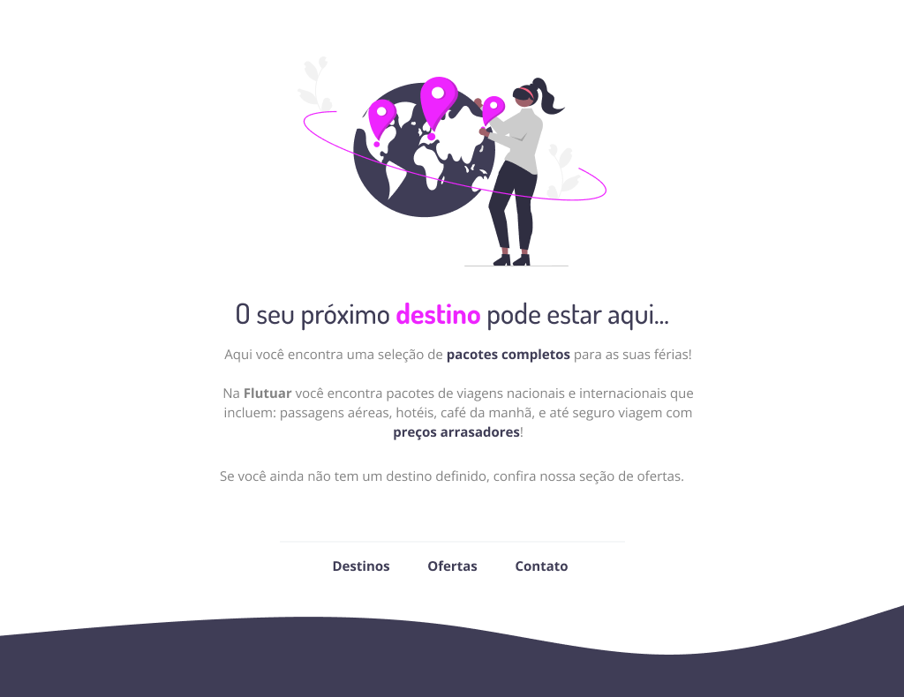

<h1 align="center">🥠 Biscoito da Sorte</h1>

    <a style="font-size: 18px" href="https://elias-neto.github.io/Explorer/nivel02/stage02/desafios/flutuar.com" target="_blank"> Veja o Site</a>

 

## 💻 Projeto

Landing Page de uma empresa de viagens.

## 📥 Conhecimento adquirido

- Estruturando um projeto HTML;
- Uso de tags HTML mais comuns;
- Conceitos iniciais de CSS;
- Posicionamento e alinhamento de elementos na tela;
- Aplicando fontes customizadas;
- Espaçamentos.

## 🛠 Tecnologias usadas

- [HTML](https://www.w3schools.com/html/)
- [CSS](https://www.w3schools.com/css/default.asp)
- [Figma](https://www.figma.com/design/)

 
 

 Desenvolvido com ❤ por Elias de Araújo Ferreira Neto 👋 

 

<a href="../../README.md">Voltar</a>
