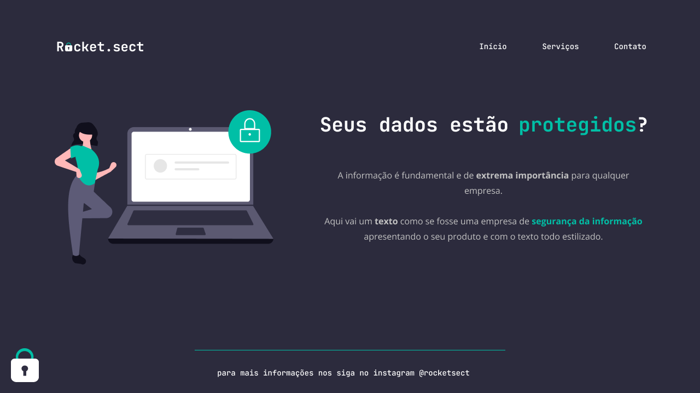

<h1 align="center">Rocket.sect 🔒</h1>

    <a style="font-size: 18px" href="https://elias-neto.github.io/Explorer/nivel02/stage02/desafios/recriando_layout"> Veja o Site</a>

 

<h2> 💻 Desafio </h2>
Neste desafio, eu recriei uma aplicação a partir de um layout do figma. Essa aplicação é uma landing page para a uma empresa fictícia de segurança da informação, a "Rocket.sect".
 
 

<h2> 📥 Conhecimento adquirido </h2>

* Acessibilidade por meio de elementos semânticos e a descrição de imagens no HTML;
* Flexbox;
* Box-model;
* Fontes estilizadas;
* Formato de cores (Hexadecimal e HSL);
* Link que abre em outra aba (atributo target="_blank");
* Fixar um elemento na tela;
* Organização do código com comentários.

 
 

<h2> 🛠 Tecnologias usadas </h2>

O projeto foi desenvolvido utilizando as seguintes tecnologias:

- [HTML](https://www.w3schools.com/html/)
- [CSS](https://www.w3schools.com/css/default.asp)
- [Figma](https://www.figma.com/design/)

 
 

 Desenvolvido com 💜 por Elias de Araújo Ferreira Neto 👋 

 

<a href="../../README.md">Voltar</a>