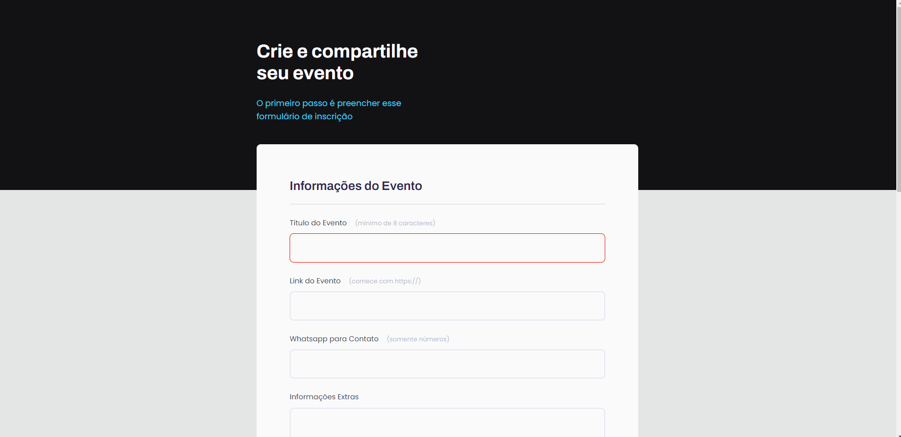

<h1 align="center">Crie seu Evento 📝</h1>

    <a style="font-size: 18px" href="https://elias-neto.github.io/Explorer/nivel02/stage02/projeto01" target="_blank"> Veja o Site</a>

 

<h2> 💻 Projeto </h2>

Este projeto consiste em uma landing page com um formulário para a criação de eventos.

 
 

<h2> 📥 Conhecimento adquirido </h2>

* Criação e funcionamento de formulários em HTML (form [atributos action e method], fieldset, legend, label, input, textarea, select, button);
* Tipos de inputs (text, password, number, checkbox, date, time, email);
* Como funciona a propriedade CSS z-index;
* Como funciona a propriedade box-sizing;
* O que são e para que servem vendor prefixes (-moz, -webkit, -ms);
* Como aplicar SVG direto no CSS;
* Como estilizar um campo select;
* Pseudo Elements e Pseudo Classes no CSS - o que são, como usar e quais diferenças;
* Como estilizar checkbox;
* Como validar campos e submeter formulários. 

 
 

<h2> 🛠 Tecnologias usadas </h2>

O projeto foi desenvolvido utilizando as seguintes tecnologias:

- [HTML](https://www.w3schools.com/html/)
- [CSS](https://www.w3schools.com/css/default.asp)
- [Figma](https://www.figma.com/design/)

 
 

 Desenvolvido com 💜 por Elias de Araújo Ferreira Neto 👋 

 

<a href="../README.md">Voltar</a>