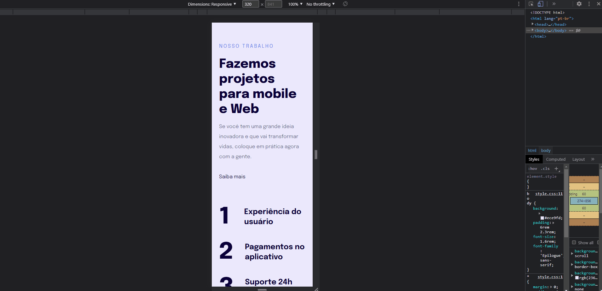

<h1 align="center">Nosso Trabalho 📱</h1>

    <a style="font-size: 18px" href="https://elias-neto.github.io/Explorer/nivel03/stage03/projeto02" target="_blank"> Veja o Site</a>

 

<h2> 💻 Projeto </h2>

Este projeto consiste em uma landing page **responsiva** para divulgação de um trabalho.

 
 

<h2> 📥 Conhecimento adquirido </h2>

- O que é responsividade;
- O que é mobile-first e porquê usar?;
- Trabalhar com unidades de medida flexíveis/relativas;
- Trabalahar com max-width e min-width;
- O que é e como trabalhar com at-rule @media;

 
 

<h2> 🛠 Tecnologias usadas </h2>

O projeto foi desenvolvido utilizando as seguintes tecnologias:

- [HTML](https://www.w3schools.com/html/)
- [CSS](https://www.w3schools.com/css/default.asp)
- [Figma](https://www.figma.com/design/)

 
 

 Desenvolvido com ⤠por Elias de Araújo Ferreira Neto 👋 

 

<a href="../README.md">Voltar</a>
