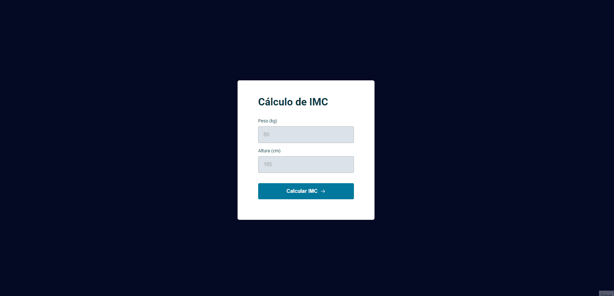

<h1 align="center">🔢 IMC</h1>

    <a style="font-size: 18px" href="https://elias-neto.github.io/Explorer/nivel05/stage/imc" target="_blank"> Veja o Site</a>

 

## 💻 Projeto

Site que calculao IMC do usuário.

- Verifica e alerta se os dados são válidos.
- Apresneta o resultado em um Modal Popup

## 📥 Conhecimento adquirido

- Modal Popup
- ES6 Modules
- Clean Code
- Refatoração
- Manipulação da DOM
- Eventos

## 🛠 Tecnologias usadas

- [HTML](https://www.w3schools.com/html/)
- [CSS](https://www.w3schools.com/css/default.asp)
- [JavaScript](https://developer.mozilla.org/pt-BR/docs/Web/JavaScript)
- [Figma](https://www.figma.com/design/)

 Desenvolvido com ❤ por Elias de Araújo Ferreira Neto 👋 

 

<a href="../README.md">Voltar</a>
