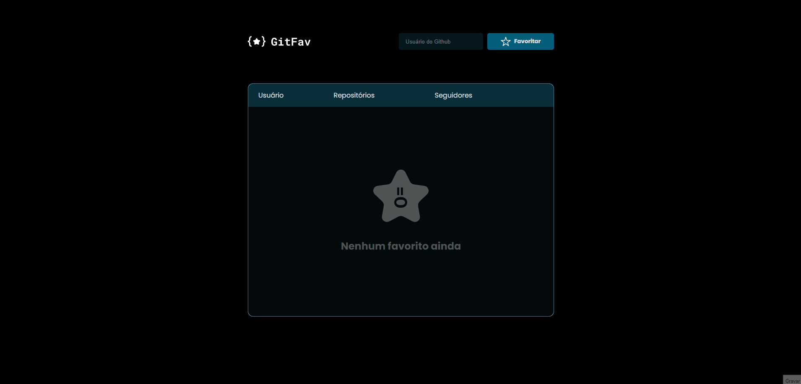

<h1 align="center">⭐ GitHub Favorites</h1>

    <a style="font-size: 18px" href="https://elias-neto.github.io/Explorer/nivel06/stage/github_favorites" target="_blank"> Veja o Site</a>

 

## 💻 Projeto

Um site para você favoritar os perfis do github que você mais curte :)

## 📥 Conhecimento adquirido

- Tabelas no HTML;
- Acessibilidade com `sr-only`;
- Pseudo-classes no CSS;
- Orientação a Objetos;
- Manipulação da DOM;
- Higher Order Function's;
- Princípio da Imutabilidade;
- Trabalhar com `localStorage`;
- Métodos estáticos;
- Assincronismo e Promessas;
- Trabalhar com `Async Await`;
- Tratar erros com `try, catch, throw`
- Consumo de API;
- Desconstrição de Objetos;
- ES6 Modules;

## 🛠 Tecnologias usadas

- [HTML](https://www.w3schools.com/html/)
- [CSS](https://www.w3schools.com/css/default.asp)
- [JavaScript](https://developer.mozilla.org/pt-BR/docs/Web/JavaScript)
- [Figma](https://www.figma.com/design/)

 
 

 Desenvolvido com ❤ por Elias de Araújo Ferreira Neto 👋 

 

<a href="../README.md">Voltar</a>
