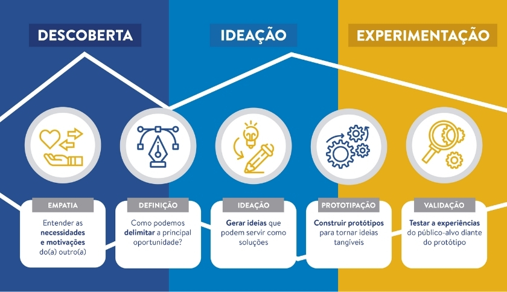

# 💡 Land 09

> Inspiração de ideias - Resolução de problemas - MVP - Design Thinking

## 💡 Inspiração de ideias

### Inspiração por demanda

- Não tem um compromisso com necessariamente criar algo novo. O projeto é definido pelo cliente e/ou pela empresa.

- Os requisitos podem até mudar, mas geralmente a ideia central do projeto permanece.

### Inspiração para empreender

- Empreender não é necessariamente criar algo novo. Pode ser, por exemplo, melhorar a experiência de um produto que já existe. Automatizar uma rotina já conhecida, etc.

- Geralmente aqui a inspiração de um problema para resolver.

### Inspiração para projetos pessoais

- Olhe para o seu dia a dia. Existe algo que você pode automatizar?

- Será que você pode criar uma ferramenta para tornar alguma rotina do seu dia a dia mais simples?

- Converse com pessoas próximas a você. Será que você pode criar alguma aplicação que pode ajudá-las?

### Ferramentas para inspiração

- 📌 [Dribble](https://dribbble.com/)
- 📌 [UpLabs](https://www.uplabs.com/)
- 📌 [Figma Community](https://www.figma.com/community)

## 🎯 Projetos Pessoais

> Cuidado com projetos grandes demais.

- Você pode enjoar ou desanimar dele.

> Cuidado com a complexidade.

- O projeto tem que ser um meio para deixar você animado(a) para aplicar o que aprendeu.

> Tente encontrar um equilíbrio entre um assunto que você gosta e uma habilidade que você quer aprender.

## ✅ Resolução de Problemas

> Divida para conquistar.

- Quebre um problema maior em problemas menores e faça uma coisa de cada vez.
- Isso te dará uma sensação de conquista e progresso.

## 🤏 MVP (Minimum Viable Product)

- Desenvolver um MVP é uma excelente estratégia pra você construir e criar algo de forma rápida, objetiva e eficiente para poder ter algo palpável para medir e validar uma ideia e aprender com os erros, ou seja, evoluir o mais cedo possível.

- O objetivo do MVP é criar o mínimo possível para que você possa usufruir dos benefícios da tua ideia, sem se preocupar em ter um design perfeito, uma arquitetura robusta, em seguir os melhores padrões...

- O desenvolvimento de um MVP é um processo pragmático. É fazer só o essencial para o projeto funcionar, de uma forma simples e objetiva. O intuito disso, é ter o mínimo para poder validar se a ideia funciona, identificar as dores, aprender com elas e ir construindo algo melhor.

## 🧠 Design Thinking

Design Thinking, também conhecida como técnica do duplo diamante, é uma estratégia utilizada em processos de **inovação**.

> OBS: inovar não é necessariamente criar algo nunca visto, inovar é dar vida a novas ideias, sejam elas ideias para melhorar algo já existente ou ideia de algo totalmente novo.

O Design Thinking divide esse processo de inovação em processos menores: Descoberta, Ideação e Experimentação.

### 🧐 Descoberta

Aqui é onde você vai de fato entender o propósito da ideia, qual problema que ela tá resolvendo.

O processo de descoberta é composta por dois processos: **Empatia** e **Definição**.

#### Empatia

O foco aqui é entender as necessidades e motivações das outras pessoas, as necessidades e motivações que geram o problema que você quer resolver.

- _Por que as pessoas precisam dessa solução?_
- _Por que elas vão usar essa aplicação?_

> Se coloque no lugar da outra pessoa, de quem vai usufruir da solução.

### Definição

O foco aqui é delimitar a principal oportunidade.

- _Qual é o problema específico que essa aplicação vai atacar?_
- _Onde especificamente essa aplicação vai contribuir?_

### 🤔 Ideação

Aqui é onde você vai pensar em como por essa ideia em prática, como resolver o problema de fato.

Uma estratégia muito útil nessa etapa é fazer um **brainstorm**. Um brainstorm ("chuva de ideias") é você tirar as ideias da cabeça e colocá-las no papel, começar a estruturar e organizar elas para melhor compreensão.

### 😤 Experimentação

Aqui você respira fundo e inicia a por a mão na massa, a fazer acontecer, a tornar as ideias tangíveis.

Aqui entram a criação de protótipos, o código, os testes, etc. (É nessa etapa que começa de fato o desenvolvimento do MVP, por exemplo).

### 💎 "Técnica do Duplo Diamante"

A técnica do Design Thinking também leva essa nome pois os processos convergência/singularização e divergência/pluralização de ideias formam um "gráfico" que parece dois diamantes juntos.

- Descoberta -> Ideação = Processo de Singularização/Convergência de ideias, escopo fechado.

- Ideação -> Experimentação = Processo de Pluralização/Divergência de ideias, escopo aberto.

- Experimentação em diante = Processo de Singularização/Convergência de ideias, escopo fechado.
