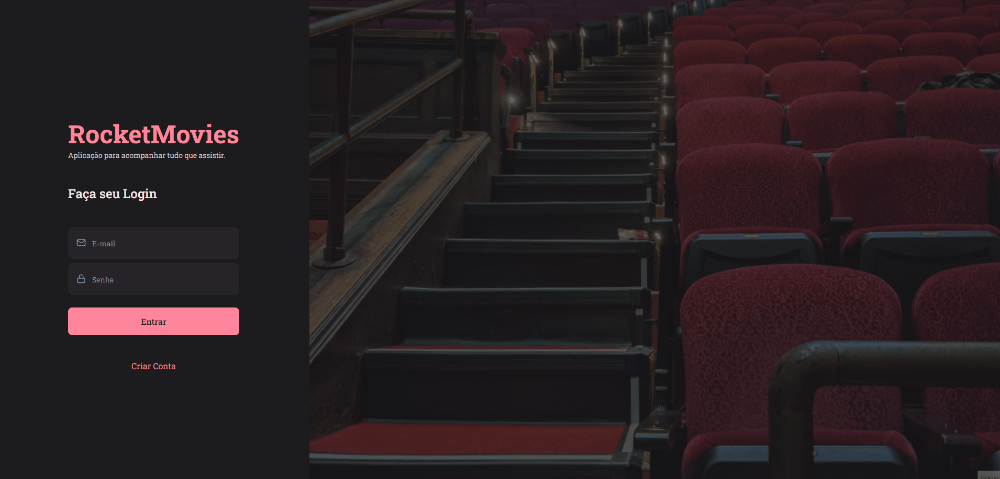

<h1 align="center">📽 Front-end RocketMovies</h1>

 

## 💻 Projeto

Front-end de uma aplicação de criação de notas sobre filmes, o RocketMovies.

No RocketNotes você poderá criar sua conta e desfrutar de um ambiente para você registrar suas anotações sobre filmes.

Você registrar o filme (com título e descrição) e atribuir uma nota para ele.

As anotações podem conter tags para deixá-las mais completas.

A aplicação é composta por as seguintes telas:

- Login;
- Criação de conta;
- Home;
- Detalhes de nota;
- Criação de nota;
- Edição de perfil;

## 📥 Conhecimento adquirido

- O que é o ReactJS;
- O que é e como trabalhar com o ViteJS;
- Arquitetura de pastas e arquivos;
- Fragment;
- CSS in-JS (Styled Components);
- `thema` e `globalStyle`;
- Componentes e Propriedades;
- React Icons;
- React Router Dom;

## 🛠 Tecnologias usadas

- [ReactJS](https://pt-br.reactjs.org/)
- [Styled Components](https://styled-components.com/)
- [React Icons](https://react-icons.github.io/react-icons/)
- [React Router Dom](https://reactrouter.com/en/main)
- [ViteJS](https://vitejs.dev/)
- [JavaScript](https://developer.mozilla.org/en-US/docs/Learn/JavaScript)
- [HTML](https://developer.mozilla.org/pt-BR/docs/Learn/HTML)
- [CSS](https://developer.mozilla.org/pt-BR/docs/Web/CSS)
- [Figma](https://www.figma.com)

 
 

 Desenvolvido com ❤ por Elias de Araújo Ferreira Neto 👋 

 

<a href="../README.md">Voltar</a>
